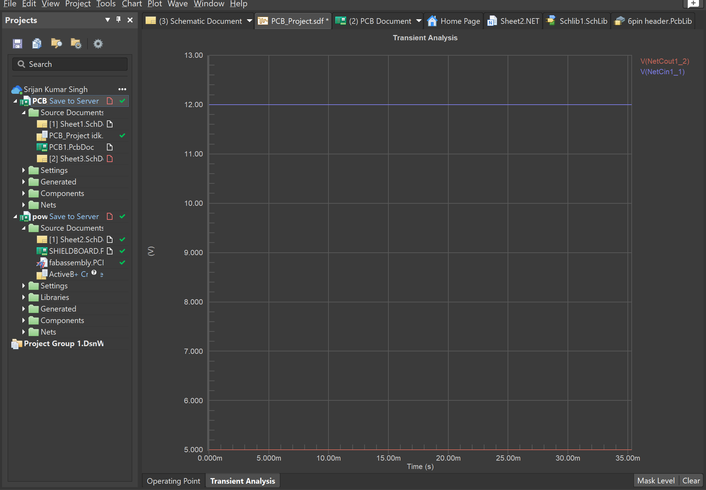

# Arduino-Power-Regulator-Shield

This is a power regulator circuit that is built on an arduino shield. This is inpired by a project that is included under the Altium Education's "Pcb Design Basic Course"

The main objective of this project is to learn how to design PCB for basic electronics circuits on the Altium Designer environment.

Input: 12V DC,  The board will provide this stable power supply to a bank of LEDs connected in parallel
Output: 5V DC that goes into  the Arduino 

Functional Requirements:

- Receive power from a 12 V DC input
- Regulate power down to 5 V DC
- Deliver 12 V DC power to a bank of 2 LED lights in parallel
- Provide 5 V DC power to the main Arduino Uno board
- Provide enough current to power the Arduino and the LEDs
- Regulate power with at least 90% efficiency
- LEDs must be SMD parts with high power output (at least 10 W each)
- Power input connection is provided by standard 16 AWG wire
- Components must be placed only on the top layer
- Total board thickness must be standard thickness (approximately 62 mils)

TLDR
Take 12V DC input-> utilizing the circuitry that includes capacitors, an inductor and two flyback resistors based on TPS562201DDCR power regulator chio, step down input to 5V -> feed 5V to arduino 

# SPICE Simulation and Transient Analysis
As part of the power regulator PCB design project, the circuit was simulated using Altium Designer’s built-in Mixed-Signal Circuit Simulator (SPICE engine). Transient analysis was performed to evaluate the regulator’s dynamic response to changes in input voltage and load conditions.

First I drew the schematic, next I copied it, made some changes and tested them using SPICE. However, TI chips usually do not have SPICE models available for their chips, especially for TPS562201DDCR. Hence I needed to search online to find a .cir file that can emulate the functions of the power regulator chip and use that on the simulation. All the model .cir files can be found in the models folder.

The simulation results demonstrate the output voltage stability and transient behavior of the regulator, verifying the effectiveness of the chosen components and layout design. 
A sample transient analysis waveform is included below, showing the regulator’s output voltage settling time and steady-state performance under typical operating conditions.

Files and Documents:

- The powerregulatorarduino.pdf includes the embed schematic and pcb design ready to be viewed on microsoft edge/embed on github
- Schematic can be found at Sheet2.SchDoc
- SHIELDBOARD.PcbDoc has the PCB ready to be inspected on Altium Designer
- 6pin header.PcbLib is a pcb library I created to replicate Arduino 6/8/10 pin headers on a PCB for the shield
- powerregulatorarduino.PrjPcb loads the whole project with all its components and settings.
- fabassembly.PCBDwf has fabrication rules as well as assembly rules. 
- models folder conatins the necessary .cir files that provide models for simulation of the power regulator as well as the high dielectric constant capacitors on the input side. 

Ps. this is my first PCB design project so if I made some major and/or silly erros let  me get away with that. While very basic circuitry, doing this project and its pcb design process flow taught me more than any other resource. Thanks!